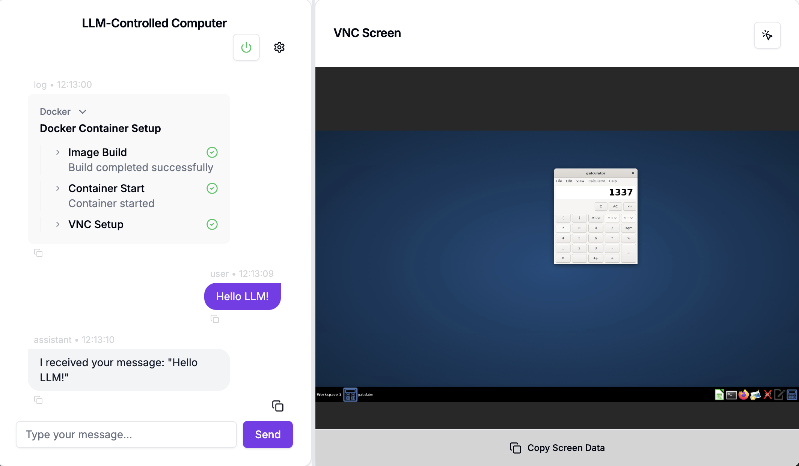

# LLM-Controlled Computer

A Next.js application that uses a large language model to control a computer through both local system control and virtual machine (Docker) environments.

[](https://nextjs.org)
[](https://www.typescriptlang.org)
[](https://langchain.com)
[](https://www.docker.com)
[](https://ui.shadcn.com)
[](https://tailwindcss.com)
[](https://www.electronjs.org)
[](https://cursor.com)



> **🚧 Work in Progress**
>
> This project is under active development. Some features may be incomplete or subject to change.
>
> The overall goal is to create a tool that allows a user to control their computer with any large language model in nodejs. Anthropics [Computer Use Demo](https://github.com/anthropics/anthropic-quickstarts) is the main inspirational source for this project.
>
> Roadmap:
>
> - ✅ Docker container management
> - ✅ VNC integration
> - ✅ Chat interface
> - 🔳 (Generic) LLM integration
>   - ✅ Base architecture
>   - ✅ Model selection
>   - ✅ Model tracking
>   - ✅ Message history
>   - 🔳 Context management
>   - 🔳 Function calling
>   - ⬜ Streaming support
> - ⬜ Computer use tooling
>   - ⬜ File management
>   - ⬜ Screenshot analysis
>   - ⬜ Mouse and keyboard control
>   - ⬜ Bash command execution
> - 🔳 Launch options
>   - ⬜ CLI
>   - ✅ Web server
>   - ⬜ Electron app
> - 🔳 Computer Use modes
>   - ✅ Virtual (Docker)
>   - ⬜ Local (direct control)
> - ⬜ Conversation history
> - ⬜ Multi Agent support
> - ⬜ Memory management
>
> Please check back later for updates or **feel free to contribute!**

## Features

### Core Capabilities

- Screenshot analysis
- Mouse and keyboard control
- Bash command execution
- File management
- Chat interface for LLM interaction
- VNC-based graphical interactions

### Operation Modes

- **Local Mode**: Direct system control
- **Docker Mode**: Virtual machine control via Docker containers
- **Multiple Launch Options**:
  - Web browser (Next.js server)
  - Desktop application (Electron)
  - CLI for specific LLM tasks

### Docker Integration

- Real-time container management
- Build progress streaming
- Container lifecycle control (start, stop, delete)
- Status monitoring and detailed logging
- NoVNC integration for web-based access
- Automated environment setup

### User Interface

- Responsive split-view layout
- Settings sidebar
- Real-time Docker status indicators
- Expandable log entries
- Copy-to-clipboard functionality
- Auto-scrolling chat interface

## Tech Stack

- **Frontend**: Next.js with TypeScript
- **UI Components**: Radix UI, Tailwind CSS
- **Container Management**: Dockerode
- **Remote Access**: VNC, SSH2
- **LLM Integration**: Langchain.js
- **Desktop Packaging**: Electron
- **Terminal**: node-pty, xterm.js

## Prerequisites

- Node.js (LTS version)
- Docker
- Python 3.11.6 (for certain features)

## Installation

### 1. Clone the repository

```bash
git clone [repository-url]
cd llm-controlled-computer
```

### 2. Install dependencies

```bash
npm install
```

### 3. Set up environment variables

```bash
cp .env.example .env
```

Edit `.env` with your configuration.

## Development

Start the development server:

```bash
npm run dev
```

### Building

For production build:

```bash
npm run build
```

For Electron desktop app:

```bash
npm run build:electron
```

## Docker Usage

The application includes a custom Docker environment with:

- Ubuntu 22.04 base
- Python environment with pyenv
- Desktop environment with VNC access
- Firefox ESR with pre-configured extensions
- Various utility applications

## Contributing

1. Ensure you follow the project's coding standards:
   - Use TypeScript with strict typing
   - Follow clean code principles
   - Write comprehensive tests
   - Add proper documentation

2. Submit pull requests with:
   - Clear description of changes
   - Test coverage
   - Documentation updates

## License

ISC
